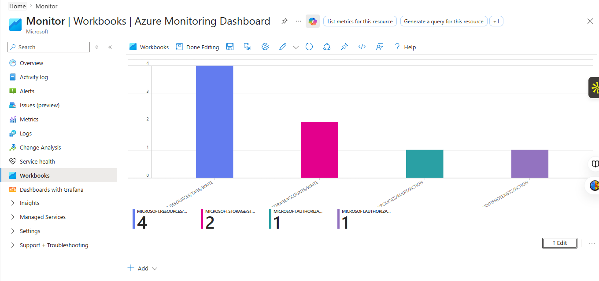
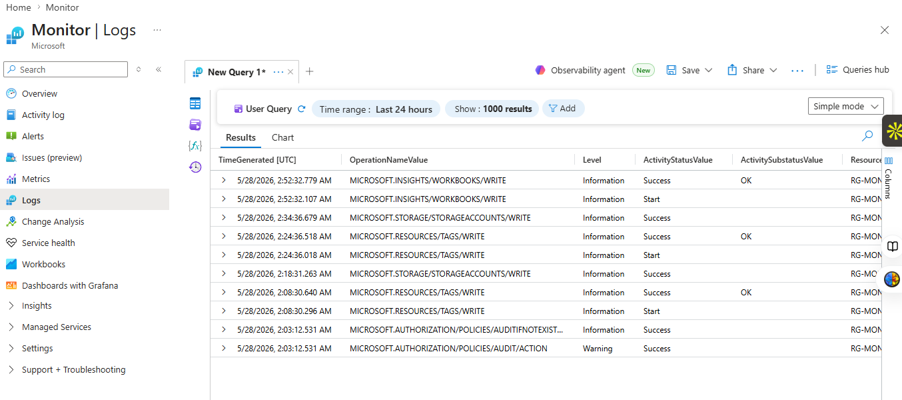
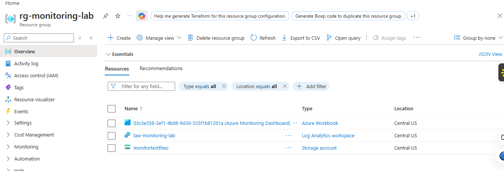
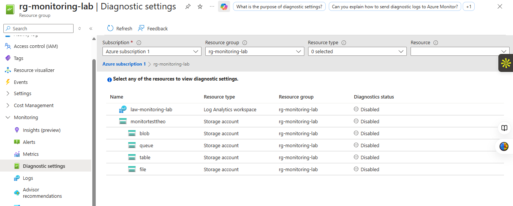
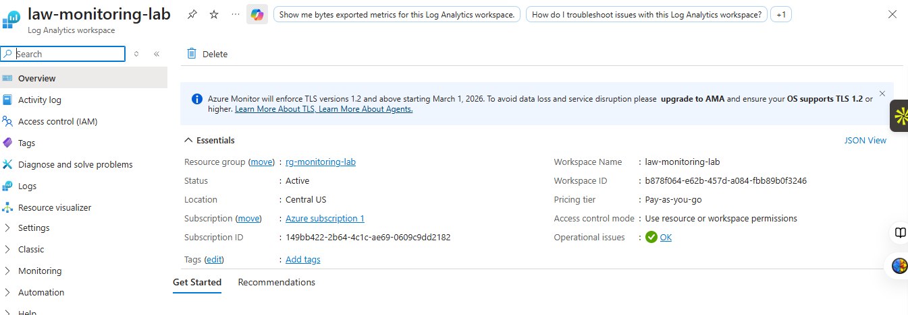
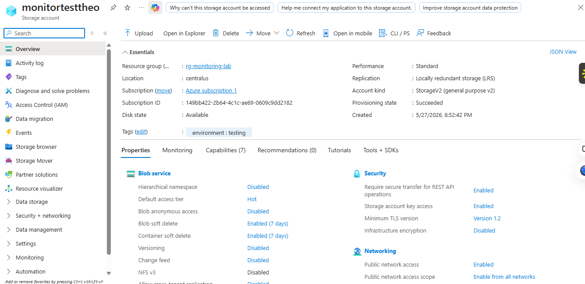
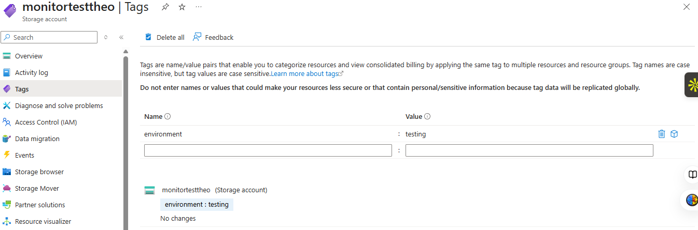

# Azure Monitoring Dashboard Project

Enterprise-style Azure cloud monitoring and observability project built using Azure Monitor, Azure Activity Logs, Log Analytics Workspace, Kusto Query Language (KQL), Azure Workbooks, Diagnostic Settings, Azure Storage Accounts, and Azure governance tagging.

This project demonstrates how cloud engineers and cloud operations teams monitor Azure infrastructure by collecting operational activity, routing logs into a centralized analytics platform, querying cloud events using KQL, and visualizing operational data inside an Azure monitoring dashboard.

The environment was intentionally designed to remain lightweight, isolated, and cost-conscious while still simulating real-world cloud monitoring workflows used in enterprise environments.

---

## Project Overview

The purpose of this project was to build a fully functioning Azure monitoring lab capable of:

- Collecting Azure operational activity
- Monitoring administrative actions
- Querying cloud logs using KQL
- Visualizing cloud activity with dashboards
- Tracking governance and tagging changes
- Centralizing monitoring data
- Practicing cloud observability engineering
- Demonstrating Azure operations workflows
- Building a portfolio-ready monitoring project

The monitoring environment was deployed inside its own isolated Azure resource group to prevent interference with other Azure projects and simplify organization and cleanup.

---

## Project Objectives

The primary objectives of this project were to:

- Learn Azure Monitor workflows
- Understand Azure Activity Logs
- Configure Diagnostic Settings
- Route logs into Log Analytics Workspace
- Practice Kusto Query Language (KQL)
- Build operational monitoring dashboards
- Track Azure resource activity
- Demonstrate governance concepts
- Practice cost-conscious Azure architecture
- Simulate enterprise cloud monitoring workflows

---

## Environment Architecture

The monitoring environment includes:

| Azure Resource | Purpose |
|---|---|
| Resource Group | Isolated monitoring environment |
| Log Analytics Workspace | Centralized log collection and querying |
| Azure Monitor Logs | Operational monitoring platform |
| Diagnostic Settings | Log routing configuration |
| Azure Activity Logs | Azure operational event collection |
| Azure Workbook | Monitoring dashboard visualization |
| Storage Account | Test resource used to generate activity |
| Resource Tags | Governance and environment tracking |

---

## Azure Resources Created

### Resource Group

```text
rg-monitoring-lab
```

Dedicated Azure resource group used to isolate monitoring resources from other Azure projects.

---

### Log Analytics Workspace

```text
law-monitoring-lab
```

Centralized logging workspace used for collecting, storing, and querying Azure operational activity.

---

### Storage Account

```text
monitortesttheo
```

Test resource used to generate legitimate Azure Activity Log events for monitoring and dashboard visualization.

---

### Azure Workbook Dashboard

```text
Azure Monitoring Dashboard
```

Azure Workbook dashboard used to visualize operational activity collected inside Azure Monitor Logs.

---

## Technologies Used

- Microsoft Azure
- Azure Monitor
- Azure Activity Logs
- Log Analytics Workspace
- Azure Workbooks
- Kusto Query Language (KQL)
- Azure Diagnostic Settings
- Azure Resource Groups
- Azure Storage Accounts
- Azure Resource Tags
- Azure Portal
- Cloud Governance Concepts
- Operational Dashboarding
- Cloud Monitoring Workflows

---

## Monitoring Workflow

The monitoring workflow for this project followed the following process:

1. Create isolated Azure resource group
2. Deploy Log Analytics Workspace
3. Configure Diagnostic Settings
4. Route Azure Activity Logs into Log Analytics
5. Generate operational events using Azure resources
6. Query logs using KQL
7. Build visual dashboards using Azure Workbooks
8. Organize resources using governance tags
9. Validate operational visibility through Azure Monitor

---

## Azure Activity Logs

Azure Activity Logs were used to monitor operational events occurring throughout the Azure environment.

Examples of monitored activity included:

- Resource creation
- Resource write operations
- Storage account updates
- Deployment validation
- Workbook creation
- Resource tagging activity
- Policy audit events
- Administrative operations

These logs provide visibility into what changes occur inside Azure environments and help cloud teams monitor operational health, governance activity, and deployment events.

---

## Kusto Query Language (KQL)

KQL was used to search and analyze Azure Activity Logs.

Example query used to display recent Azure activity:

```kql
AzureActivity
| sort by TimeGenerated desc
```

Example query used for dashboard visualization:

```kql
AzureActivity
| summarize Count=count() by OperationNameValue
| top 10 by Count desc
```

These queries help identify operational trends and frequently occurring Azure operations.

---

## Azure Workbook Dashboard

An Azure Workbook dashboard was created to visualize operational activity captured inside Azure Monitor Logs.

The dashboard displays:

- Resource operations
- Write activity
- Governance activity
- Policy events
- Operational event frequency

This provides a simplified operational overview similar to dashboards used by cloud operations and monitoring teams in enterprise environments.

---

## Governance and Tagging

Resource tags were applied to simulate enterprise governance practices.

Tag used:

```text
environment = testing
```

Tags are commonly used in enterprise cloud environments for:

- Cost tracking
- Resource organization
- Environment classification
- Automation workflows
- Reporting
- Governance policies

Updating tags also generated additional Azure Activity Log events visible inside the monitoring environment.

---

## Why This Project Matters

Monitoring and observability are critical skills for:

- Cloud Engineers
- Cloud Administrators
- DevOps Engineers
- Site Reliability Engineers
- Security Operations Teams
- Platform Engineers

This project demonstrates practical hands-on experience with:

- Cloud monitoring
- Operational visibility
- Centralized logging
- Dashboard visualization
- Governance tracking
- Azure operational workflows
- KQL querying
- Cloud cost awareness

The project moves beyond basic resource deployment and demonstrates real observability engineering concepts used in production cloud environments.

---

## Cost and Resource Management

This project was intentionally designed to remain lightweight and cost-conscious while still demonstrating real-world Azure monitoring and observability concepts.

The environment was built using minimal Azure resources to avoid unnecessary charges while still generating legitimate Azure operational activity.

### Cost Optimization Decisions

The following decisions were made to help keep the project within free-tier or low-cost usage levels:

- Used a dedicated resource group for easy cleanup
- Avoided virtual machines and compute-heavy services
- Avoided Microsoft Sentinel ingestion costs
- Avoided paid Microsoft Defender plans
- Used Azure Activity Logs instead of high-volume telemetry ingestion
- Used one lightweight Log Analytics Workspace
- Created only one small test storage account
- Selected Locally Redundant Storage (LRS)
- Kept all resources inside a single Azure region
- Generated only lightweight administrative activity
- Avoided continuous traffic generation
- Avoided unnecessary monitoring categories
- Used manual test activity instead of automated scripts

### Azure Resources Used

| Resource Type | Purpose |
|---|---|
| Resource Group | Organize and isolate the monitoring lab |
| Log Analytics Workspace | Centralized log collection and querying |
| Azure Workbook | Dashboard visualization |
| Diagnostic Settings | Route logs into Log Analytics |
| Azure Activity Logs | Capture operational activity |
| Storage Account | Generate real Azure events |
| Resource Tags | Demonstrate governance and tracking |

### Estimated Cost Behavior

Under light educational usage, the project should remain very low cost because:

- Azure Activity Logs are platform-generated
- No virtual machines are running
- No large telemetry ingestion is occurring
- No long-term retention changes were configured
- Minimal storage was consumed
- Workbook visualization itself is lightweight

The project was specifically designed for learning, portfolio building, and cloud operations practice without creating unnecessary Azure spending.

---

## Project Screenshots

### 1. Azure Monitoring Dashboard

Final Azure Workbook dashboard visualizing Azure operational activity and KQL query results.



---

### 2. KQL Query Results

Azure Monitor Logs displaying Azure Activity Log query results using Kusto Query Language (KQL).



---

### 3. Resource Group Architecture

The dedicated monitoring resource group containing the Log Analytics Workspace, Workbook, and Storage Account resources.



---

### 4. Diagnostic Settings

Diagnostic settings configured to route Azure Activity Logs into the Log Analytics Workspace.



---

### 5. Log Analytics Workspace Overview

Overview of the centralized Log Analytics Workspace used for monitoring and querying Azure operational activity.



---

### 6. Storage Account Overview

Storage account resource used to generate real Azure operational events for monitoring and visualization.



---

### 7. Resource Tags

Governance tag configuration applied to Azure resources for environment classification and organizational tracking.



---

## Project Outcome

The project successfully demonstrated how Azure monitoring infrastructure can be configured to:

- Collect Azure operational activity
- Centralize cloud logs
- Query events using KQL
- Visualize cloud operations
- Monitor resource changes
- Track governance activity
- Organize cloud resources
- Build operational dashboards
- Practice observability engineering concepts

This project serves as a practical cloud engineering portfolio project focused on Azure monitoring, cloud observability, and operational visibility.

---

## Skills Demonstrated

- Azure Monitor
- Log Analytics Workspace
- Kusto Query Language (KQL)
- Azure Activity Logs
- Azure Workbooks
- Diagnostic Settings
- Cloud Observability
- Operational Monitoring
- Azure Governance
- Resource Tagging
- Cloud Cost Awareness
- Azure Portal Administration
- Technical Documentation
- Dashboard Visualization

---

## Project Status

Completed.

The Azure monitoring environment successfully collected, queried, and visualized real Azure operational activity using Log Analytics, KQL, Azure Monitor, and Azure Workbooks.
